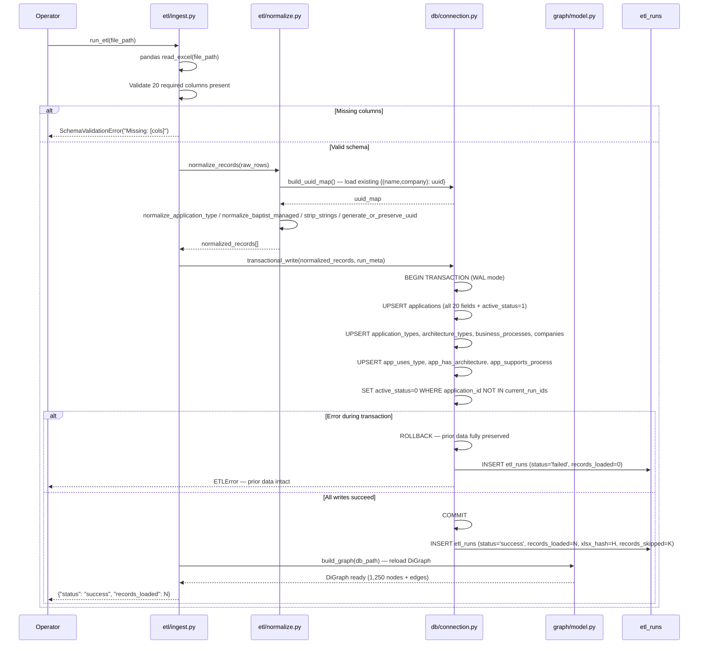

# Implementation Plan: IT Knowledge Graph Ingestion Pipeline

**Branch**: `knowledge-graph-ingestion` | **Date**: 2026-06-12 | **Spec**: [spec.md](spec.md)

**Input**: Feature specification from `specs/knowledge-graph-ingestion/spec.md`

---

## Summary

Epic 1 establishes the platform foundation: a Python ETL pipeline ingests the Baptist Health CMDB XLSX export (1,250 application records, 20 columns), normalizes fields into a SQLite relational database with a graph-ready schema (node + edge tables), and exposes that data through a React web interface — a paginated application browse table, a full-detail slide-in panel, and a topbar data-refresh trigger with real-time WebSocket progress.

All subsequent epics depend on this foundation: Epic 2 reads the node/edge tables and in-memory networkx graph loaded here; Epic 3 extends the ETL pipeline with ChromaDB embeddings; Epic 4 queries the SQLite data through the FastAPI backend built here.

**Technical approach**: Local, open-source only. Python (pandas, openpyxl, sqlite3, networkx) for the backend. FastAPI + uvicorn for the API layer. React 18 + Vite for the SPA. No cloud services at runtime.

---

## Technical Context

| Dimension | Value |
|-----------|-------|
| **Language/Version** | Python 3.10+ (3.11 recommended); TypeScript / React 18.x |
| **Primary Dependencies** | FastAPI 0.110+, uvicorn 0.29+, pandas 2.x, openpyxl 3.x, networkx 3.x, chromadb 0.4.x+ (stub in Epic 1), sentence-transformers 2.x (stub in Epic 1), openai 1.x (stub in Epic 1), React 18.x, Vite 5.x |
| **Storage** | SQLite 3.35+ (`data/cmdb.db`, WAL mode); ChromaDB SQLite-backed (`data/chroma/`) |
| **Testing** | pytest for backend unit + integration; Vitest for React components |
| **Target Platform** | Windows / macOS local developer machine; no cloud runtime |
| **Project Type** | Web application — FastAPI REST + WebSocket backend; React SPA frontend |
| **Performance Goals** | ETL < 5 min for 1,250 records (CPU); SQL queries < 2s; API responses < 3s |
| **Constraints** | No cloud infrastructure; no GPU; single-file SQLite; no authentication in v1 |
| **Scale/Scope** | 1,250 application records; SQLite + networkx scale to ~50k before architecture change needed |

---

## Constitution Check

*GATE: Must pass before Phase 0 research. Re-check after Phase 1 design.*

The `.specify/memory/constitution.md` contains placeholder template content — no project-specific principles have been ratified. There are no constitution gates to check.

Design decisions are governed by the architecture decision log (AD-001 through AD-012) in `docs/architecture.md`. All decisions in this plan are consistent with those decisions.

**Post-Phase 1 recheck**: No violations. All choices align with AD-001 (SQLite), AD-002 (networkx), AD-006 (FastAPI), AD-007 (React + Vite), AD-008 (no auth MVP), AD-009 (PII fence), AD-010 (WAL mode).

---

## Project Structure

### Documentation (this feature)

```text
specs/knowledge-graph-ingestion/
├── plan.md              # This file
├── research.md          # Design decisions and rationale (Phase 0)
├── data-model.md        # SQLite schema — entities, DDL, relationships (Phase 1)
├── quickstart.md        # End-to-end validation guide (Phase 1)
├── contracts/
│   ├── api.md           # REST API and WebSocket contract (Phase 1)
│   └── ui.md            # UI design contract — design system, layouts, components (Phase 1)
└── tasks.md             # Implementation tasks (/speckit-tasks — not yet created)
```

### Source Code (repository root)

```text
it-knowledge-graph/
├── .env                        ← OPENAI_API_KEY (NEVER commit)
├── .gitignore                  ← .env, data/, __pycache__/, node_modules/
├── requirements.txt
├── backend/
│   ├── main.py                 ← FastAPI app, lifespan startup (graph load), CORS
│   ├── db/
│   │   ├── schema.sql          ← SQLite DDL (all tables + WAL pragma)
│   │   └── connection.py       ← Connection helper (WAL mode, parameterized queries)
│   ├── etl/
│   │   ├── ingest.py           ← XLSX read → schema validation → record parsing
│   │   ├── normalize.py        ← Field normalization + UUID generate/preserve
│   │   └── embed.py            ← sentence-transformers → ChromaDB (Epic 3; stub in Epic 1)
│   ├── graph/
│   │   ├── model.py            ← networkx DiGraph builder from SQLite edge tables
│   │   └── queries.py          ← Redundancy/vendor queries (Epic 2; stub in Epic 1)
│   ├── agent/
│   │   ├── orchestrator.py     ← OpenAI agent (Epic 4; stub in Epic 1)
│   │   └── tools.py            ← sql_analytics, graph_traversal, semantic_search (Epic 4)
│   └── api/
│       └── routes.py           ← Epic 1 route handlers
├── frontend/
│   ├── src/
│   │   ├── App.tsx
│   │   ├── surfaces/
│   │   │   ├── Dashboard.tsx       ← Metric cards + last refresh
│   │   │   ├── Applications.tsx    ← Paginated table + filter bar
│   │   │   ├── Query.tsx           ← Navigation shell (Epic 4)
│   │   │   ├── Analytics.tsx       ← Navigation shell (Epic 2)
│   │   │   └── Redundancy.tsx      ← Navigation shell (Epic 2)
│   │   ├── components/
│   │   │   ├── Sidebar.tsx
│   │   │   ├── Topbar.tsx
│   │   │   ├── DetailPanel.tsx
│   │   │   ├── FilterBar.tsx
│   │   │   ├── MetricCard.tsx
│   │   │   └── RefreshForm.tsx
│   │   └── api/
│   │       └── client.ts
│   └── vite.config.ts
└── data/                       ← Runtime data (gitignored)
    ├── cmdb.db
    └── chroma/
```

**Structure Decision**: Option 2 (Web application) with `backend/` and `frontend/` directories. Matches `docs/architecture.md` Section 6.

---

## Components

### Backend Components

| Component | Module | Responsibility in Epic 1 |
|-----------|--------|--------------------------|
| **XLSX Ingestor** | `backend/etl/ingest.py` | pandas `read_excel`, validate 20-column schema, parse rows into dicts, emit per-record error logs |
| **Field Normalizer** | `backend/etl/normalize.py` | Normalize `application_type`, `baptist_managed`, strip whitespace; generate/preserve UUIDs (key: name+company) |
| **SQLite Writer** | `backend/db/connection.py` | WAL mode connection; transactional UPSERT to all tables; ROLLBACK on any error; soft-delete absent records; write `etl_runs` |
| **Schema DDL** | `backend/db/schema.sql` | DDL for `applications`, node tables, edge tables, `etl_runs`; WAL pragma |
| **Graph Loader** | `backend/graph/model.py` | Build `networkx.DiGraph` from SQLite edge tables at startup; reload after each successful ETL |
| **FastAPI App** | `backend/main.py` | Lifespan startup (graph load), CORS (`localhost:5173`), route mounting, error handlers |
| **Route Handlers** | `backend/api/routes.py` | All Epic 1 endpoints (health, applications, refresh trigger, refresh status) |
| **Embed Stub** | `backend/etl/embed.py` | No-op stub in Epic 1; method signature + PII exclusion contract defined for Epic 3 |

### Frontend Components

| Component | File | Responsibility in Epic 1 |
|-----------|------|--------------------------|
| **App Router** | `App.tsx` | React Router — 5 surfaces; sidebar navigation layout |
| **Sidebar** | `Sidebar.tsx` | Glassmorphism nav (`rgba(29,50,105,0.88)`, `blur(16px)`); 240px/64px/drawer responsive; `role="navigation"` |
| **Topbar** | `Topbar.tsx` | "Refresh Data" button (always visible at all breakpoints); refresh status display |
| **Dashboard** | `Dashboard.tsx` | 4 metric cards (total, COTS, Homegrown, last refresh); skeleton loaders on cold load |
| **Applications Surface** | `Applications.tsx` | Paginated table (50/page); filter bar; name search; teal Application Name links |
| **Detail Panel** | `DetailPanel.tsx` | 480px slide-in; all 20 CMDB fields; NULL → "Not specified"; focus trap; Escape/backdrop close |
| **Filter Bar** | `FilterBar.tsx` | Dropdowns: Application Type, Business Process, Company, Baptist Managed; immediate apply; badge + "Clear filters" |
| **Metric Card** | `MetricCard.tsx` | Stat card; skeleton loader; hover shadow elevation (120ms); click-through to surface |
| **Refresh Form** | `RefreshForm.tsx` | Inline file upload; .xlsx client+server validation; WebSocket progress; success/failure states |
| **API Client** | `api/client.ts` | Typed fetch wrapper for all backend endpoints |
| **Shell Surfaces** | `Query.tsx`, `Analytics.tsx`, `Redundancy.tsx` | Navigation shells in Epic 1 — "Coming soon" placeholder content |

---

## UI Design

See full UI contract in [contracts/ui.md](contracts/ui.md). Design is derived from six reference mockups in `docs/mockups/`.

### Design System

| Token | Value | Usage |
|-------|-------|-------|
| `--primary` | `#1D3269` | Sidebar, headings, metric values, nav active |
| `--accent` | `#00A8CC` | CTA buttons, links, active filters, left-border indicator |
| `--surface` | `#F8FAFC` | Page background, table headers, input backgrounds |
| `--border` | `#E2E8F0` | All borders and dividers |
| `--fg` | `#0F172A` | Primary text |
| `--muted` | `#64748B` | Secondary text, labels, placeholders |

Font: **Inter** (Google Fonts). Min viewport: **1440px**. Card radius: 16px. Button radius: 8px.

### Application Shell

The application is a 1440px-wide single-page app with a permanent 240px glassmorphism sidebar and a sticky 56px topbar. Content fills the remaining space.

**Sidebar**: `rgba(29,50,105,0.88)` + `backdrop-filter: blur(16px)`. Five nav items with left-border active indicator (3px solid `#00A8CC`). Avatar footer with user initials.

**Topbar**: white, border-bottom, page title left + "Refresh Data" CTA button right (accent bg). Metadata text shows last refresh date and app count.

### Pages and Surfaces

| Route | Surface | Epic 1 Status |
|-------|---------|---------------|
| `/` | **Dashboard** — 4 metric cards (Total Apps, App Types, Redundancy Clusters, Business Processes). Shell rows for charts. | Full |
| `/applications` | **Applications** — paginated table (50/page) + search/filter bar + sort toggle + pagination bar. Detail panel on name click. | Full |
| `/query` | **Query** — hero input box + results table + history panel | Shell only (Epic 4) |
| `/analytics` | **Analytics** — filter bar + type/arch/process/company/vendor charts | Shell only (Epic 2) |
| `/redundancy` | **Redundancy** — cluster accordion cards + stats row | Shell only (Epic 2) |

Shell surfaces must implement the sidebar, topbar, and nav exactly as in the mockups — with a "Coming soon" placeholder in the content area.

### Key UI Behaviours

| Behaviour | Spec |
|-----------|------|
| Detail panel open | 480px panel slides in from right, `translateX(100%→0)`, 0.3s `cubic-bezier(0.16,1,0.3,1)`. Backdrop `rgba(15,23,42,0.40)` dims rest of viewport. |
| Detail panel close | ✕ button, Escape key, or backdrop click. Focus returns to triggering link. |
| Filter update | Immediate — no submit button. Filter badge appears when active. "Clear filters" link resets all. |
| NULL field display | Always "Not specified" in muted italic — never blank, never the string "null". |
| Refresh Data flow | Topbar button opens inline form. File upload → .xlsx client-side check → POST → WebSocket progress spinner → success/error state for 5s → reverts to normal. |
| Active nav item | Left border `3px solid #00A8CC` + `rgba(0,168,204,0.20)` bg. Only one active at a time. |
| Metric card gradient bar | 3px top strip: `linear-gradient(90deg, #1D3269, #00A8CC)`, opacity 0.7. |

### Accessibility

All surfaces must meet WCAG 2.1 AA. Key requirements:
- Sidebar nav: `role="navigation"`, visible focus ring on all items
- Detail panel: `role="dialog"`, `aria-label`, focus trap while open
- Application Name links: `aria-label="View {name} details"`
- Skeleton loaders: `aria-hidden="true"` while loading
- Badges: always include text label (never colour alone as sole differentiator)

---

## Sequence Diagrams

### Diagram 1: ETL Pipeline Execution



### Diagram 2: Web UI Data Refresh

```mermaid
sequenceDiagram
    participant Op as Operator (Browser)
    participant React as React SPA :5173
    participant API as FastAPI :8000
    participant BG as BackgroundTask (ETL)
    participant WS as WebSocket /ws/refresh

    Op->>React: Click "Refresh Data" (topbar)
    React-->>Op: Inline RefreshForm panel opens
    Op->>React: Select file → Submit

    React->>React: Client-side: file.name.endsWith('.xlsx')?
    alt Not .xlsx
        React-->>Op: "Only .xlsx files are accepted."
    else Valid .xlsx
        React->>API: POST /api/refresh (multipart/form-data)
        API->>API: Server-side .xlsx validation
        API-->>React: 202 {"run_id": "uuid", "status": "running"}
        React->>WS: Connect ws://localhost:8000/ws/refresh?run_id=uuid
        React-->>Op: Spinner "Refreshing…"

        API->>BG: BackgroundTask(run_etl, tmp_path, run_id)

        loop Progress events
            BG->>WS: {"step": "normalizing", "records_processed": N}
            WS-->>React: progress event
            React-->>Op: Update indicator
        end

        BG->>WS: {"status": "success", "records_loaded": 1250, "timestamp": "2026-06-12T..."}
        WS-->>React: Completion event; WS closes
        React-->>Op: "Updated · Jun 12, 2026 · 1,250 apps" (5s) → reverts
        React->>API: GET /api/refresh/status (topbar timestamp)
        React->>API: GET /api/analytics/distributions (Dashboard reload)
    end
```

### Diagram 3: Application Browse and Detail Panel

```mermaid
sequenceDiagram
    participant User
    participant React as React SPA
    participant API as FastAPI
    participant SQLite as SQLite DB

    User->>React: Navigate to /applications
    React-->>User: Skeleton loaders (aria-hidden="true")
    React->>API: GET /api/applications?page=1&page_size=50
    API->>SQLite: SELECT * WHERE active_status=1 ORDER BY application_name LIMIT 50
    SQLite-->>API: 50 rows (all 20 fields)
    API-->>React: {results:[...], total:1250, page:1, pages:25}
    React-->>User: Table renders — "1,250 applications"

    User->>React: Select filter: Application Type = COTS
    React->>API: GET /api/applications?application_type=COTS&page=1&page_size=50
    API->>SQLite: SELECT * WHERE application_type='COTS' AND active_status=1
    SQLite-->>API: Filtered results
    API-->>React: {results:[...], total:N}
    React-->>User: Table updates; filter badge appears; "Clear filters" visible

    User->>React: Click Application Name (teal link)
    React->>API: GET /api/applications/{application_id}
    API->>SQLite: SELECT all 20 fields WHERE application_id=?
    SQLite-->>API: Single application record
    API-->>React: 20-field JSON
    React-->>User: 480px panel slides in (translateX 240ms ease-out); backdrop dims to 40%

    User->>React: Press Escape (or ✕ or backdrop)
    React-->>User: Panel closes; focus returns to triggering link
```

---

## APIs

See full contract in [contracts/api.md](contracts/api.md).

**Epic 1 endpoints:**

| Method | Path | Description | Response |
|--------|------|-------------|----------|
| `GET` | `/api/health` | Dev setup check | `{"status": "ok"}` |
| `GET` | `/api/applications` | Paginated + filtered app list | `{results[], total, page, pages}` |
| `GET` | `/api/applications/{id}` | Full 20-field record | Application object or 404 |
| `POST` | `/api/refresh` | Upload XLSX + trigger ETL | `202 {run_id, status}` |
| `GET` | `/api/refresh/status` | Last ETL run status | `{last_run_at, records_loaded, status}` |
| `WebSocket` | `/ws/refresh` | Real-time ETL progress | Progress + completion events |

---

## Database Schema

See full DDL in [data-model.md](data-model.md).

**Node tables**: `applications` (20 CMDB fields + UUID + active_status), `application_types`, `architecture_types`, `business_processes`, `companies`

**Edge tables**: `app_uses_type`, `app_has_architecture`, `app_supports_process`

**ETL state**: `etl_runs` (run_id, run_at, xlsx_hash, records_loaded, records_skipped, status)

**Key constraints**: WAL mode enabled; all SQLite writes parameterized; foreign keys enforced; ETL wrapped in a single atomic transaction.

---

## Security

| Control | Implementation |
|---------|---------------|
| **API key protection** | `OPENAI_API_KEY` in `.env` only; `.env` in `.gitignore`; confirmed never committed |
| **PII exclusion from embeddings** | `embed.py` input: `name + description` only — Business Owner, T&D App Owner, Primary Engineer, Last Updated By excluded; enforced in `normalize.py` embed payload builder |
| **File type validation** | Client-side: `file.name.endsWith('.xlsx')`; Server-side: Content-Type check + pandas parse attempt; non-XLSX rejected before ETL runs |
| **SQL injection prevention** | All SQLite queries use `sqlite3` parameterized statements (`?`); no f-string or `.format()` SQL |
| **No external write-back** | Zero ServiceNow API calls; zero CMDB mutations; read-only platform |
| **Input sanitization** | All string fields stripped of whitespace before persistence; XLSX content never interpolated into file paths or shell commands |
| **Data residency** | All data on local machine; only transient OpenAI calls leave host (Epic 4 only) |

**Deferred (document for future)**: Authentication / RBAC (before any networked deployment), HTTPS/TLS (before non-localhost), rate limiting on `/api/refresh` (before multi-user).

---

## Deployment Considerations

### MVP Target: Single Local Machine

```
Developer Laptop (Windows / macOS)
├── Terminal A: uvicorn backend.main:app --reload --port 8000
├── Terminal B: cd frontend && npm run dev         ← localhost:5173
└── data/
    ├── cmdb.db       ← created by first ETL run
    └── chroma/       ← created by Epic 3 embedding run
```

### First-Run Setup

```bash
# 1. Configure environment
cp .env.example .env          # set OPENAI_API_KEY (placeholder OK for Epic 1)

# 2. Install dependencies
pip install -r requirements.txt
cd frontend && npm install && cd ..

# 3. Initialize database schema
python -m backend.db.init_schema        # runs schema.sql

# 4. Run initial ETL
python -m backend.etl.ingest --file path/to/cmdb_export.xlsx

# 5. Start backend (Terminal A)
uvicorn backend.main:app --reload --port 8000

# 6. Start frontend (Terminal B)
cd frontend && npm run dev
# → React at localhost:5173 (proxies /api/* and /ws/* to :8000)
```

### Port Requirements

| Service | Port | Override |
|---------|------|---------|
| FastAPI | 8000 | `--port XXXX` |
| React Vite dev server | 5173 | Update `vite.config.ts` proxy target |

### Data Persistence

- `data/` is gitignored — not version-controlled; must be backed up manually
- `data/cmdb.db`: portable single file; restore by copying file back
- If lost: re-run `python -m backend.etl.ingest --file <xlsx>` to rebuild

### Production-Mode Build (Demo Only)

```bash
cd frontend && npm run build && cd ..
# Add to main.py: app.mount("/", StaticFiles(directory="frontend/dist", html=True))
uvicorn backend.main:app --host 0.0.0.0 --port 8000
```

### Upgrade Path

| Current (MVP) | Upgrade Trigger | Path |
|---------------|----------------|------|
| No auth | Any shared/networked deployment | FastAPI OAuth2/JWT middleware |
| SQLite | Dataset > 50k or concurrent writers | Migrate to PostgreSQL (schema portable) |
| Two dev terminals | Team demo deployment | Docker Compose |
| `.env` secrets | Organizational deployment | HashiCorp Vault / cloud secret manager |

---

## Complexity Tracking

No constitution violations to justify. All design choices are consistent with AD-001 through AD-012 in `docs/architecture.md`. No additional complexity was introduced beyond what the architecture document specifies.
